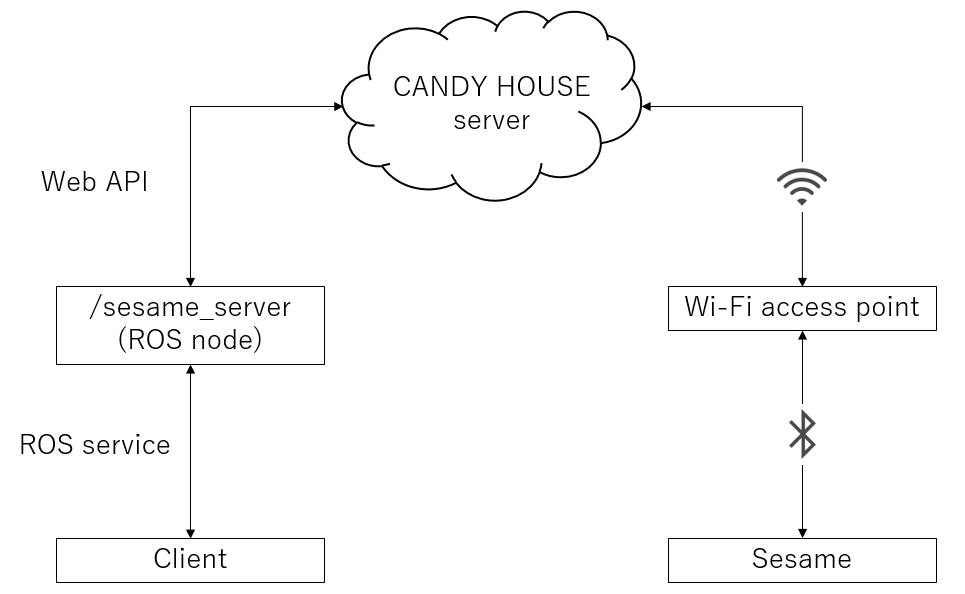

# sesame_ros

[](https://badge.fury.io/gh/YutoUchimi%2Fsesame_ros)
[](https://travis-ci.org/YutoUchimi/sesame_ros)

ROS API for Sesame smart lock made by CANDY HOUSE, Inc.




## API key

You have to create your auth token by logging into the CANDY HOUSE Dashboard: https://my.candyhouse.co/

Note that you must be the owner of your Sesame in order to use Web API.

Please make sure you can see the list of Sesames on CANDY HOUSE Dashboard.


## Python Package Requirements

This package supports catkin_virtualenv.

So, pip dependencies written in `requirements.txt` will be automatically installed into venv while building.


## Parameters

- `~auth_token` (`string`, __required__): Your auth token.

- `~device_id` (`string`, optional): UUID of your Sesame.

- `~nickname` (`string`, optional): Nickname of your Sesame.

`~device_id` and `~nickname` are used for searching Sesame from your Sesame list.

If neither of them matches or is specified, the first found Sesame will be used.

- `~command_timeout` (`int` or `float`, optional): Timeout for executing commands. Default is 60 [sec].


## Advertising services

- `~get_status` (`sesame_ros/Status`)

- `~lock` (`sesame_ros/Command`)

- `~unlock` (`sesame_ros/Command`)

- `~force_sync` (`sesame_ros/Command`)


## Defined service list

- __sesame_ros/Status__

```
---
string nickname
string serial
string device_id
int32 battery
bool locked
bool responsive
```

- __sesame_ros/Command__

```
---
string status
bool successful
string error
```


## Usage

0. Build this package.
```
$ cd YOUR_CATKIN_WS
$ catkin build sesame_ros
$ source YOUR_CATKIN_WS/devel/setup.bash
```

1. Start service server.
```
$ roscore
$ rosrun sesame_ros sesame_server.py _auth_token:=YOUR_AUTH_TOKEN _device_id:=YOUR_SESAME's_UUID
```

2. Call service.

    - To get Sesame status:
    ```
    $ rosservice call /sesame_server/get_status
    ```

    - To lock Sesame:
    ```
    $ rosservice call /sesame_server/lock
    ```

    - To unlock Sesame:
    ```
    $ rosservice call /sesame_server/unlock
    ```

    - To force the server to update Sesame status:
    ```
    $ rosservice call /sesame_server/force_sync
    ```
